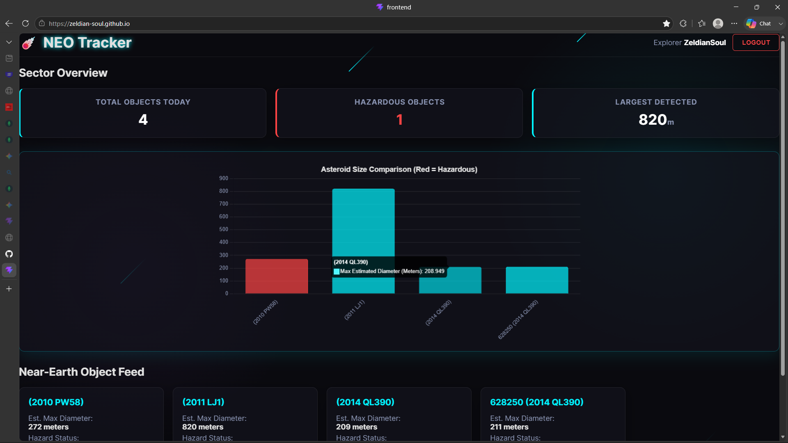
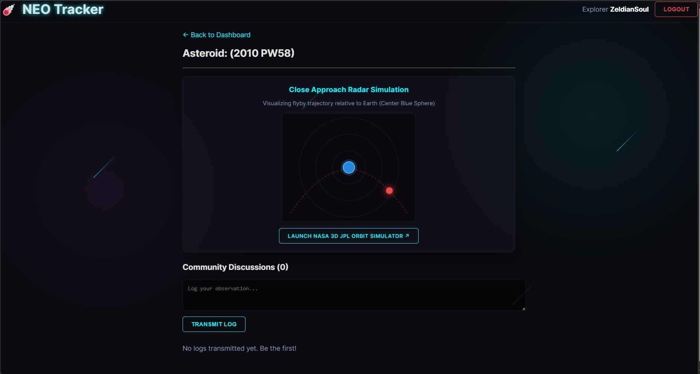
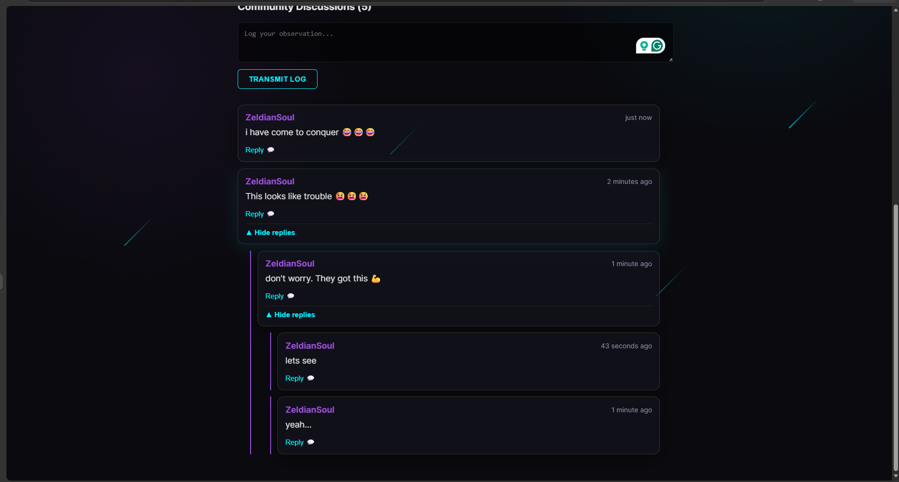
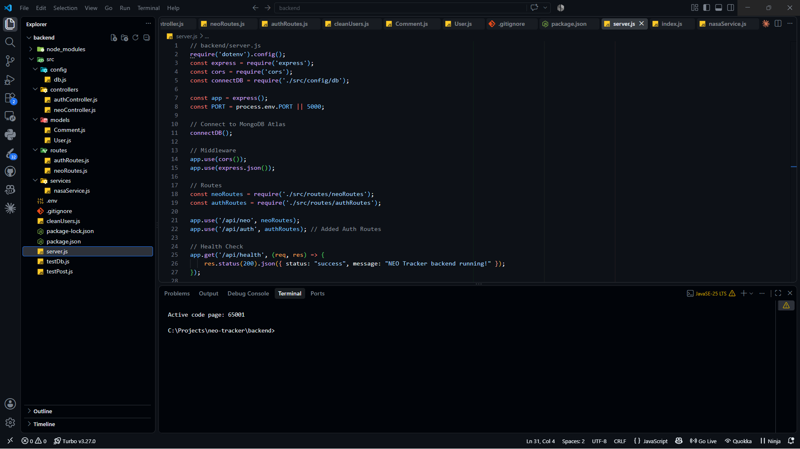

# ☄️ NEO Tracker (Near-Earth Object Tracker)

> **🚀 Live Demo:** [View the Live Application](https://zeldian-soul.github.io/neo-tracker/)

NEO Tracker is a full-stack web application that fetches real-time data from NASA's API to visualize asteroids passing by our planet. Built with a focus on interactive data visualization and community engagement.

---

## 🎨 Project Showcase

### 📊 Real-Time Analytics Dashboard
The dashboard processes live NASA data to display the total objects today, hazardous classifications, and a comparative size chart using **Chart.js**.

  

### 🛰️ Close Approach Radar Simulation
An interactive 2D canvas simulation that visualizes the flyby trajectory of selected asteroids relative to Earth. 

  

### 💬 Community Discussions
A fully integrated, nested comment system where space enthusiasts can log observations and discuss specific Near-Earth Objects.

  

### 💻 Under the Hood
A robust MVC backend architecture built to ensure high performance and resilience, including automatic fallback datasets during NASA API outages.

  

---

## 🛠️ Tech Stack

| Frontend ⚛️ | Backend ⚙️ | Deployment ☁️ |
| :--- | :--- | :--- |
| **React** (Vite) | **Node.js** & **Express** | **Vercel** (Serverless API) |
| **Chart.js** (Data Viz) | **MongoDB Atlas** (Database) | **GitHub Pages** (UI Host) |
| **Canvas API** (Radar) | **Mongoose** (Models) | **Git** (Version Control) |

---

## ✨ Key Features

* **🟢 Live NASA Integration:** Fetches and processes the NEO REST API in real-time.
* **🔴 Hazard Detection:** Highlights potentially hazardous objects based on relative velocity and miss distance.
* **🔵 Interactive Trajectories:** Custom mathematical rendering of flyby paths.
* **🟣 Resilient Architecture:** Custom retry logic and offline fallbacks to handle external API downtime gracefully.